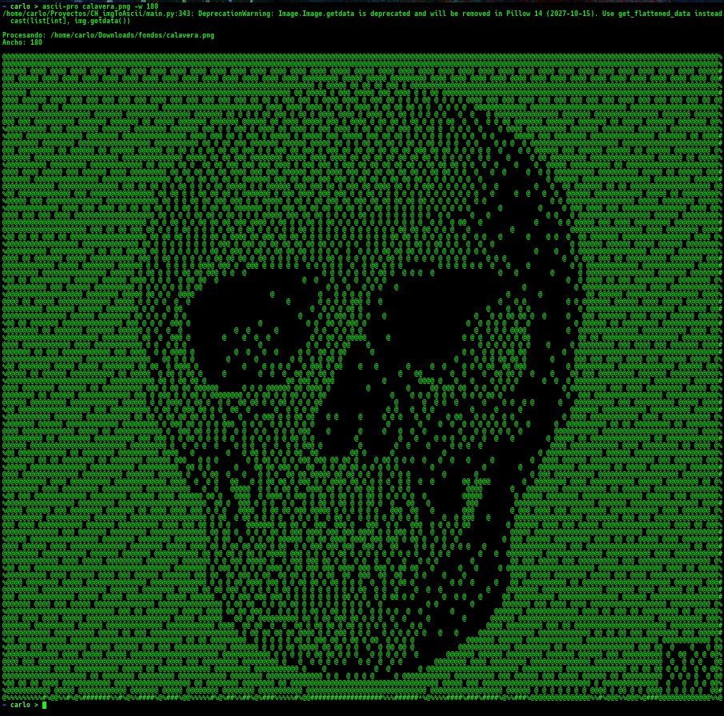
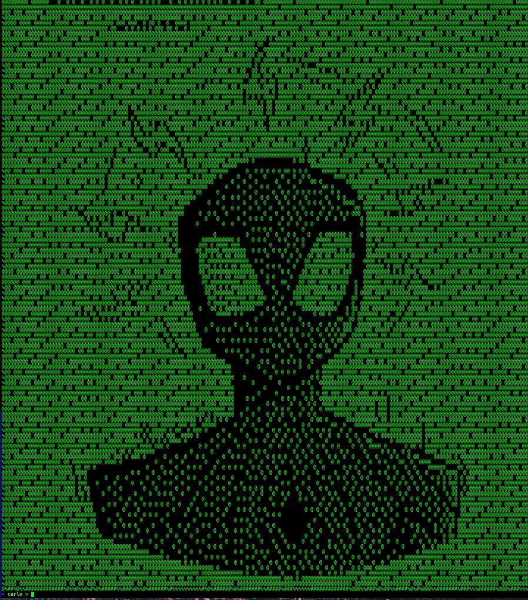

# CHASCII-PRO
Convertidor de imagen a arte ASCII hecho con python.

----------------------------------------------------------------------------------------------------

## EJECUTAR EN TERMINAL COMO:

### < chascii-pro.py image.jpg >  
Para mas precision agregar al final un ancho 
--> < -w 180 >

----------------------------------------------------------------------------------------------------

## Algunas muestras:

